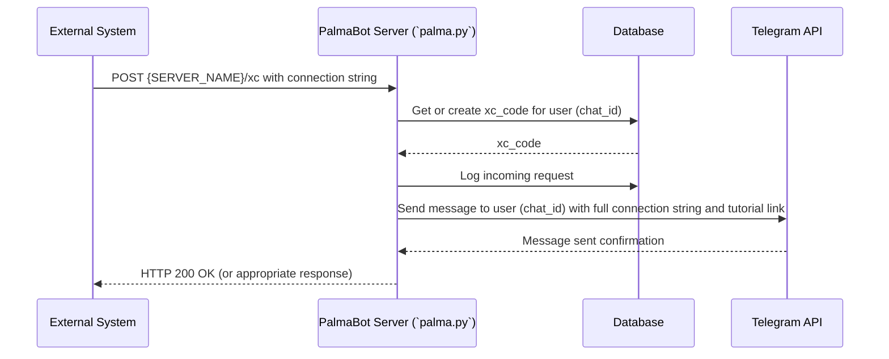

# Webhook and Real-time Functionalities

This document outlines the webhook and real-time communication systems implemented in the PalmaBot project.

## 1. PalmaBot Executor Webhook (`/xc`)

-   **File:** `palma/palma.py`
-   **Endpoint:** `{SERVER_NAME}/xc`
-   **Purpose:** This webhook is designed to connect external strategies or systems to the PalmaBot trading executor.
-   **Functionality:**
    -   When a request hits this endpoint, the system generates or retrieves a unique `xc_code` for the user (chat ID).
    -   It expects a connection string in the request, which should include:
        -   `code`: The unique user code.
        -   `strategy_id`: An identifier for the trading strategy.
        -   `demo`: (YES/NO) Specifies if the execution should be in demo mode.
        -   `command`: The trading command (e.g., `sell`, `buy`).
        -   `exchange`: The target exchange (e.g., `binance`).
        -   `coinmarket`: The coin and market pair (e.g., `BTCUSDT`).
        -   `amount`: The quantity for the trade.
    -   The system logs the incoming request.
    -   It then sends a message to the user via Telegram, providing the full connection string they need to use and a link to a tutorial on how to connect.
-   **Usage Example (from code):**
    `code={xc_code} strategy_id=MyStrategy demo=YES command=sell exchange=binance coinmarket=BTCUSDT amount=0.05`
    Webhook URL: `{SERVER_NAME}/xc`

## 2. Viber Integration Webhook

-   **File:** `palma/palma_whatsapp.py` (primary implementation)
-   **File (Legacy/Reference):** `palma/palma_social_channels.py` (contains commented-out Viber webhook setup)
-   **Endpoint:** `https://realtime.palmabot.com/viber`
-   **Purpose:** Enables PalmaBot to receive and send messages via the Viber platform.
-   **Functionality:**
    -   The `myViber` class in `palma/palma_whatsapp.py` configures the Viber bot with an authentication token and sets up a webhook to `https://realtime.palmabot.com/viber`.
    -   This allows PalmaBot to listen for events (like incoming messages) from Viber users.
    -   The `text_message` method is used to format outgoing text messages to be sent via Viber.

## 3. Trading Dashboard WebSocket

-   **File:** `palma/palma_trading_dashboard.py`
-   **Purpose:** Provides real-time communication capabilities for the Palma Trading Dashboard.
-   **Functionality:**
    -   A WebSocket server is implemented using the `websockets` library.
    -   It listens on a host and port defined in the configuration (`WEBSOCKET_HOST`, `WEBSOCKET_PORT_PTD`).
    -   **User Connection Management:**
        -   Users connect to the WebSocket, typically identified by a `user_uuid`.
        -   Supports `prijava` (register/login) and `odjava` (unregister/logout) events from clients.
        -   Maintains a record of connected users (`CONNECTED_USERS`).
    -   **Message Handling:**
        -   Receives messages from connected clients (JSON format).
        -   A `message_consumer_task` likely handles processing messages from a queue (e.g., Redis Pub/Sub via `pubsub.start_consumer_async`) to push updates to the relevant connected clients.
        -   This allows the trading dashboard to display real-time updates for orders, market data, or other relevant trading information.
    -   This is not a traditional HTTP webhook but achieves real-time, bidirectional communication between the server and the trading dashboard clients.

## Sequence Diagrams

### 1. PalmaBot Executor Webhook (`/xc`)

